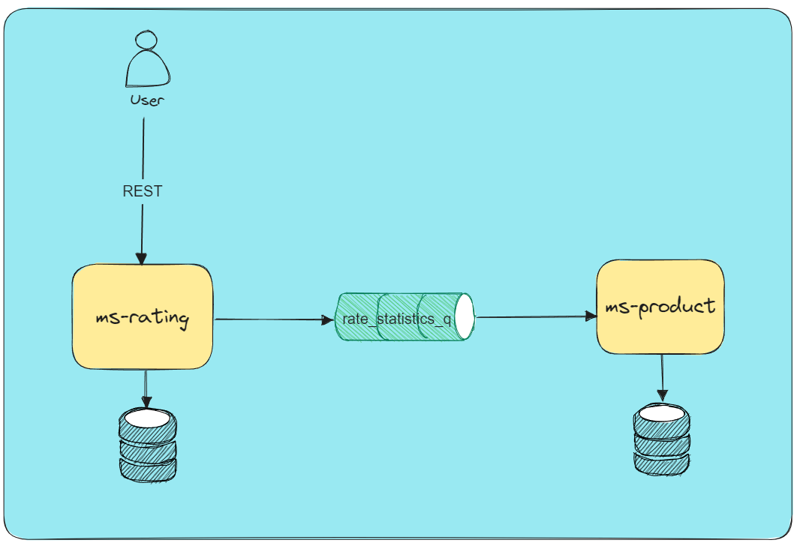

# This is product rating microservice

* Application port: 8888
* RabbitMq port:
    - 5672  -> RabbitMQ default port for AMQP
    - 15672 -> RabbitMQ Management UI port

* If user want to rate a product he/she will select one of the 5 start.
* Request header: user-id -> id of the user
* Request body: productId and rate number

          {
              "productId": 1,
              "rate": 5
          }

`curl -X POST -H "user-id: 12" -H "Content-Type: application/json" -d '{"productId": 1, "rate": 5}' http://localhost:8888/v1/ratings
`
