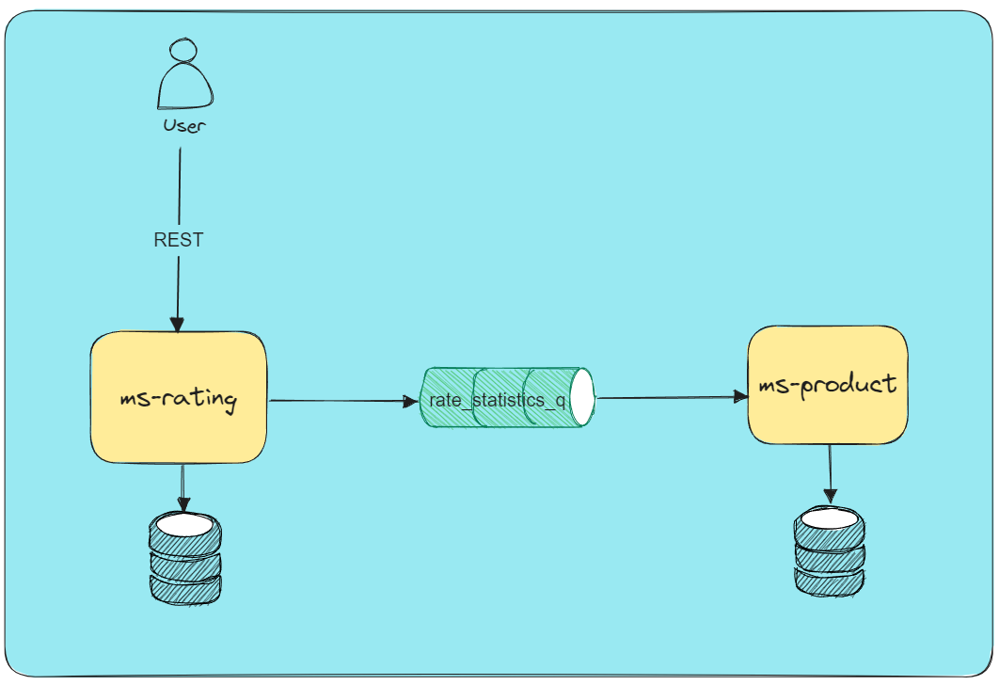
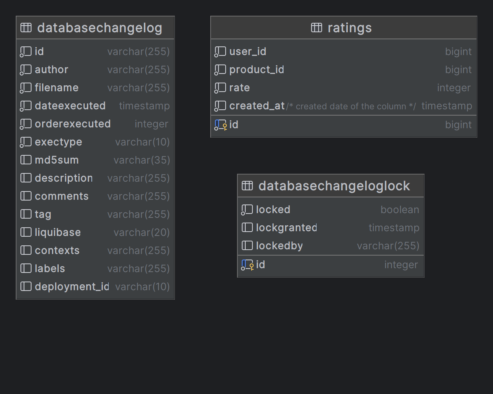

# ms-rating

# Table of description

✅ [**Description**](#description)

✅ [**Run locally**](#run-locally)

✅ [**Tech Stack**](#tech-stack)

✅ [**Application schema**](#application-schema)

✅ [**Database schema**](#database-schema)

✅ [**Swagger Link**](#swagger-link)

# Description

## This is a microservice for rating products

# Run locally

### please set at environment variables before running

    spring:
      datasource:
        username: postgres
        password: postgres
      rabbitmq:
        username: user
        password: user


```bash
java -jar build/libs/ms-rating.jar
```
# Tech stack

- Java 17
- Spring Boot 3.1.3
- PostgreSQL

# Application schema


# Database schema


# Swagger Link
[Swagger](http://localhost:8888/swagger-ui/index.html)